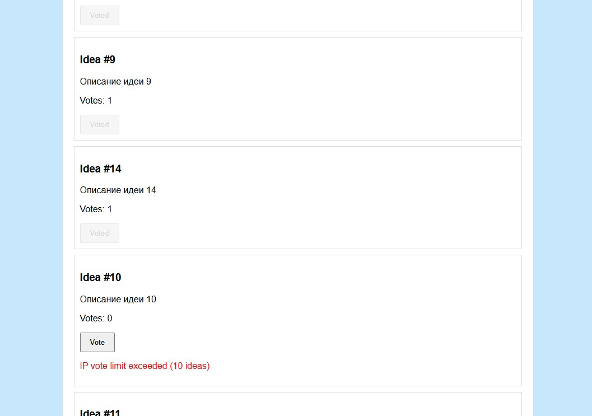

# LogicLike Voting Platform

Simple full-stack project for voting on product ideas.

## Project Structure
## logiclike/
### ─ backend/ # Fastify + TypeScript backend
### ─ frontend/ # React + TypeScript frontend

## Preview


## Setup

### Backend

```bash
cd backend
npm install
npm run dev
```

Backend runs on http://localhost:3000

Frontend
```bash
cd frontend
npm install
npm run dev
```

ENDPOINTS

List all ideas (GET /api/ideas)

Vote for ideas (POST /api/ideas/:id/vote)


---

Database is PostgreSQL 

Seed script available: seed.ts

DB connection configured in db.ts
